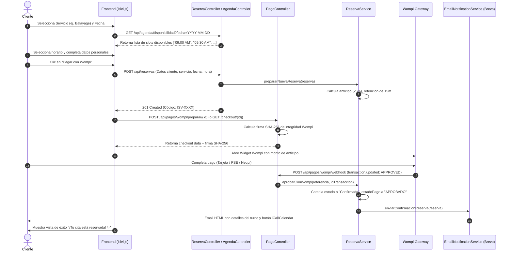
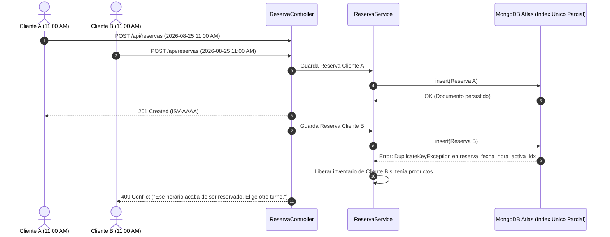

# GUÍA DE FLUJOS OPERATIVOS PASO A PASO — ISIVI

Este documento detalla los 7 flujos operativos fundamentales del sistema ISIVI de principio a fin.

---

## Flujo 1: Reserva de Cita de Servicio (Agendamiento de Turno)



---

## Flujo 2: Compra de Productos Físicos con Envío a Domicilio

1. **Selección:** El cliente añade productos al carrito, seleccionando variantes si aplican.
2. **Método de Entrega:** Selecciona *"Envío a Domicilio"*. El campo de dirección `#cart-delivery-address` se vuelve obligatorio.
3. **Checkout:** Se envían los datos a `POST /api/reservas`.
4. **Reserva Atómica:** `ReservaService.reservarInventario` descuenta el stock de inmediato con `$inc: -cantidad` y `stock >= cantidad`.
5. **No Bloqueo de Agenda:** Al ser pedido puro, `bloqueaAgenda()` retorna `false`, por lo que **no ocupa horarios de especialistas**.
6. **Pago Wompi:** `POST /api/pagos/wompi/preparar/{id}` genera la firma para pagar el 100% del subtotal.
7. **Confirmación Webhook:** `POST /api/pagos/wompi/webhook` pasa el pedido a `Pago Confirmado`. Brevo envía el email de confirmación con la dirección de entrega incluida.
8. **Vista de Éxito Front:** Muestra *"¡Tu pedido fue confirmado con éxito! 🎉"*, sin calendarios ni fechas de cita.
9. **Despacho Admin:** El personal ve el pedido en **Pedidos**, lo pasa a *"En preparación"* (`PATCH /api/reservas/{id}/pedido/preparar`), *"Listo para envío"* (`PATCH /api/reservas/{id}/pedido/listo-envio`), *"En camino"* (`PATCH /api/reservas/{id}/pedido/en-camino`) y luego a *"Entregado"* (`PATCH /api/reservas/{id}/pedido/entregar`).

---

## Flujo 3: Compra de Productos con Recogida en Salón (Pickup)

1. El cliente selecciona *"Recoger en el local (Pickup)"*. No se exige dirección.
2. Tras el pago Wompi, el pedido entra a `Pago Confirmado`.
3. Cuando el personal empaca el pedido en el salón, pulsa el botón *"Listo para Recoger"* (`PATCH /api/reservas/{id}/pedido/listo-recoger`).
4. `EmailNotificationService` despacha el email transaccional *"¡Tu pedido está listo para recoger en ISIVI!"*.
5. Cuando el cliente retira sus productos, el personal pulsa *"Entregar"* (`PATCH /api/reservas/{id}/pedido/entregar`), pasando al estado terminal `Recogido`.

---

## Flujo 4: Consulta Unificada de Reserva o Pedido (Autoservicio)

1. Cliente ingresa a la pestaña o modal *"Consultar reserva o pedido"*.
2. Ingresa su código (`ISV-...`) o su teléfono registrado.
3. Se envía `GET /api/reservas/consultar?query=...` o `POST /api/reservas/consultar`.
4. El frontend evalúa el tipo de respuesta:
   - **Si es Pedido:** Muestra el stepper de progreso adaptativo (para Domicilio: *Pago -> Prep. -> Listo Envío -> En camino -> Entregado*; para Pickup: *Pago -> Prep. -> Listo Recoger -> Recogido*), productos y método de entrega.
   - **Si es Cita:** Muestra fecha, hora, profesional, anticipo, saldo pendiente y botones para Google Calendar, Apple iCal, Reprogramación y Cancelación.

---

## Flujo 5: Cancelación de Cita (>24 Horas vs <=24 Horas)

```mermaid
graph TD
    A[Cliente solicita cancelación en portal] --> B{¿Faltan más de 24 horas?}
    B -->|Sí (>24h)| C[Cancelación Inmediata PATCH /api/reservas/{id}/cancelar]
    C --> C1[Estado pasa a 'Cancelada']
    C1 --> C2[Turno liberado en agenda]
    C2 --> C3[Stock de productos liberado]
    C3 --> C4[Email Brevo confirmando cancelación]

    B -->|No (<=24h)| D[Bloqueo de Auto-cancelación]
    D --> D1[Rechazo con CancelacionNoPermitidaException]
    D1 --> D2[Turno se mantiene ocupado]
    D2 --> D3[Alerta visual en Panel de Admin / Solicitud de Cancelación]
    D3 --> E{Decisión del Administrador}
    E -->|Aprobar PATCH /api/reservas/{id}/aprobar-cancelacion| F[Pasa a 'Cancelada', libera turno y notifica]
    E -->|Rechazar PATCH /api/reservas/{id}/rechazar-cancelacion| G[Pasa a 'Confirmado' con motivo de rechazo]
```

---

## Flujo 6: Expiración de Retención de 15 Minutos y Retoma de Pago

1. Cliente crea una reserva en `Pendiente Pago` pero cierra el navegador o no completa la transacción en Wompi.
2. Tras 15 minutos, cualquier consulta de disponibilidad o la tarea programada `archivarReservasVencidas / expirarReservasVencidas` detecta `fechaExpiracionPago < Instant.now()`.
3. Se ejecuta `marcarExpirada`: libera el stock atómicamente y libera el turno de agenda. El estado cambia a `Expirada`.
4. Si el cliente regresa más tarde al enlace de retoma (`POST /api/pagos/wompi/retomar/{id}`):
   - El sistema comprueba si el turno y los productos siguen libres.
   - Si están libres, vuelve a reservar el stock, asigna una nueva retención de 15 minutos y abre el checkout de Wompi.
   - Si el turno fue tomado por otro cliente, responde con error informando que el horario ya no está disponible.

---

## Flujo 7: Manejo de Concurrencia Extrema y Dobles Reservas


